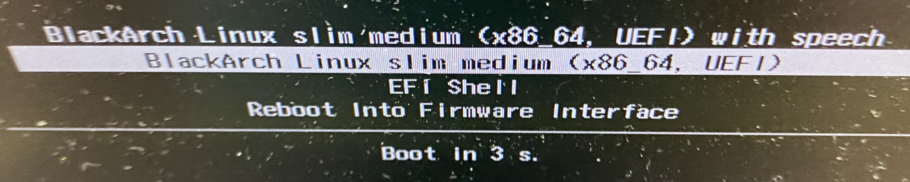
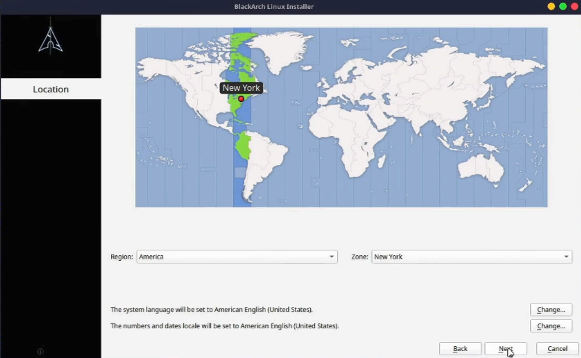
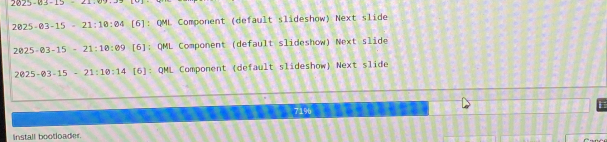
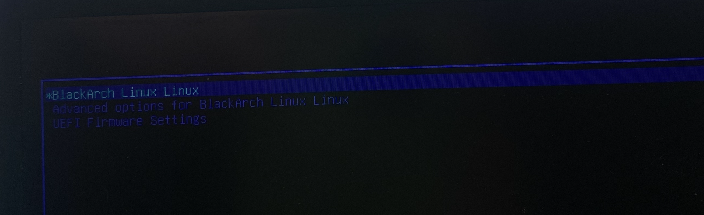
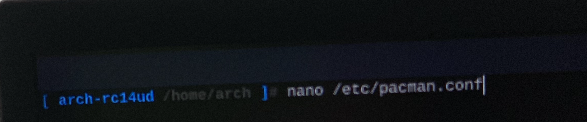
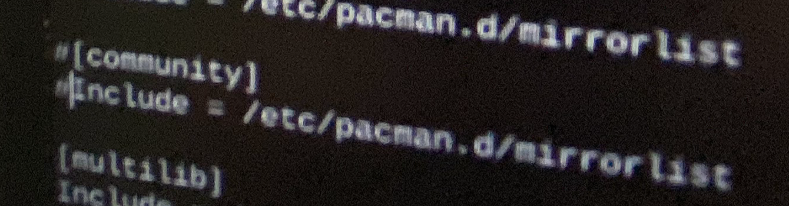
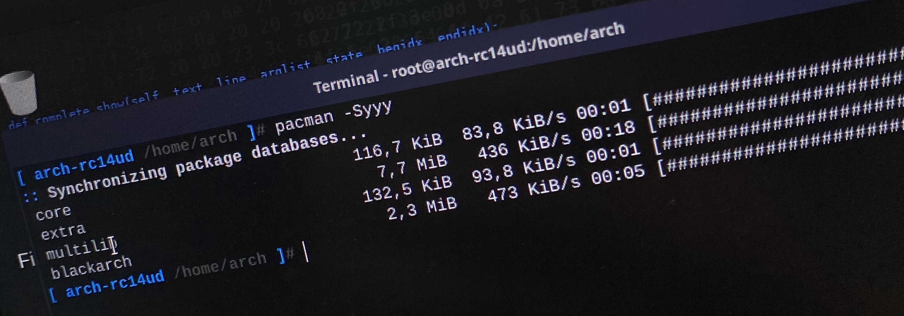

## Index

1. [Requirements](#requirements)
2. [Installation](#installation)
3. [Why don't we install with Internet access?](#why-dont-we-install-with-internet-access)
4. [Why don't we install using the "Erase disk" option?](#why-dont-we-install-using-the-erase-disk-option)

## Requirements

To install BlackArch on a USB with persistence, we need the following:

>[!Note] Requirements 
>- We need **2 USB drives**: one to install the ISO, and another to install BlackArch with persistence, which means it will boot BlackArch every time we plug it into the corresponding laptop/PC. 
>    - Minimum 8GB USB to install the [slim ISO](https://ftp.halifax.rwth-aachen.de/blackarch/iso/blackarch-linux-slim-2023.05.01-x86_64.iso)
>    - USB **+100 GB**, **essential**; otherwise, the installation will fail. It's recommended that the USB be 3.0 for optimal performance.
>      
>   

## Installation
First, we download the **ISO** from the following link:

> [Install BlackArch iso](https://www.blackarch.org/downloads.html)

To install it on the USB, we need to use software like _BalenaEtcher_ or _Rufus_. Preferably Rufus, as that is what I will use for the installation:

> [Install Rufus](https://rufus.ie/en/)

Once we have Rufus installed on our computer and the ISO downloaded, open Rufus, select the corresponding USB, select the recently downloaded BlackArch ISO, and click _Start_.
> [!info] Note 
> - Although the installation shows a 64GB USB, I eventually used a 128GB one due to installation issues.

Here, it is important to select the **DD Image mode** writing mode; otherwise, the installation won't proceed correctly using the ISO mode.

Again, ensure you have selected the correct USB since, as the warning mentions, all files on the selected USB will be erased. 

Once ready, close it and proceed as follows:

With the USB still plugged in, **restart** the computer, and as it powers back on, depending on the type or model of the BIOS in your laptop/PC, press **F2**, **F11**, **F10**, **DEL**, or **ESC**—the most common keys for accessing the BIOS. Here's a mini cheat sheet for reference:
> - Acer: F2
> - ASUS: F2
> - Dell: F2
> - HP: F10
> - Lenovo: F2 or Fn+F2
> - MSI: Del
> - Samsung: F2
> - Toshiba: F2

Next, go to **Boot Manager** and select the USB.

Once selected, choose the second option, and the installer will start.

Once inside, **DO NOT UNPLUG THE USB**, connect the other USB where BlackArch will be installed and log in.
>[!Note] Credentials  
>Login: liveuser  
>Password: blackarch

After logging in, please consider the following:
- **DO NOT start the installation from the desktop installer**, as it may cause issues during installation.
- **DO NOT connect to a Wi-Fi network with Internet access**, as errors with **pacman** might occur during installation. These errors will be resolved later.
- **Keep the laptop plugged into power during installation**, as the process may take **MORE THAN 2 HOURS**.

For the installation, open a terminal and run the Calamares Installer with `sudo`.

The installer will open. You might see a message stating that you're not connected to the Internet, but **that's okay**. Select your language and continue.

Next, select your location, whichever it may be.

Finally, choose your preferred keyboard layout:

> [!Warning] Warning  
> Do not select this option. This option will automate the installation process, but it appears to be "deprecated," and the installation will get stuck at 4%.
> 

After completing the configuration, it's time to install. Here, select the USB where BlackArch will be installed. **It's crucial to ensure the selected disk is the USB**, as selecting your laptop's/PC's disk will erase all its data.

Next, select "Manual partitioning."

Create a new partition.

Choose "GUID Partition Table (GPT)."

Then select "Free Space" and click "Create."

The first partition is for "boot," so it should have the following configuration:
- Size -> 500MB  
- File System -> fat32  
- Mount Point -> /boot/efi  
- Flags -> boot  

Then, select the remaining space and click "Create."

This remaining space will be used to install BlackArch. Configure it as follows:  
- Size -> The rest of the space  
- File System -> ext4  
- Mount Point -> /  
- Flags -> root  

Once the partitions are created, click "Next." This screen will display a summary of the partitions.

Again, make sure everything is configured correctly and click "Install."  

Now, simply wait. The installation typically takes 2 hours. There might be moments where it seems stuck, particularly at 71% when installing the bootloader.

Once installed, check "Restart now" and click "Done." While restarting, repeat the previous process and press the appropriate key to access the BIOS.

When it boots, select BlackArch in the GRUB menu and log in with the credentials you set earlier.

Now, if you try to use `pacman` to update the repositories or install software, you'll encounter the following error:

This is because on March 1, 2025, there was a migration in Arch's git repositories. You need to make the following changes for it to work. More information here -> [Arch Linux News](https://archlinux.org/news/cleaning-up-old-repositories/).

In _/etc/pacman.conf_, comment out "**[community]**" and the line that follows it: "**Include = /etc/pacman.d/mirrorlist**".

If you still encounter issues, you need to edit _/etc/pacman.d/mirrorlist_ as follows:

After commenting out those lines, you should be able to update the packages:

BlackArch is now installed on a USB with persistence. Enjoy!

## Why don't we install with Internet access?
If we are connected to the Internet, the installation will automatically update packages using `pacman`. The issue is that `pacman` is "deprecated" in this case due to the migration in Arch's old git repositories. Therefore, it's better to install without an Internet connection and fix the `pacman` issue afterward.  
> More information here: [Arch Linux News](https://archlinux.org/news/cleaning-up-old-repositories/).

## Why don't we install using the "Erase disk" option?
If we use this option, the installation will get stuck at 4% when creating the root partition. For this reason, it's always better to do it manually.

